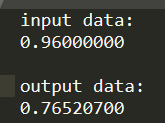
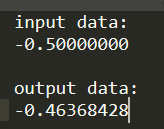
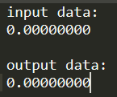
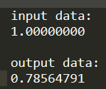
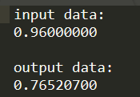
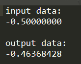
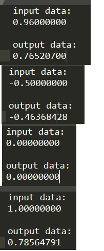
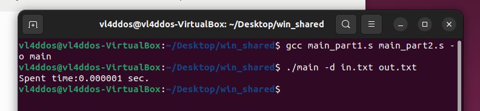
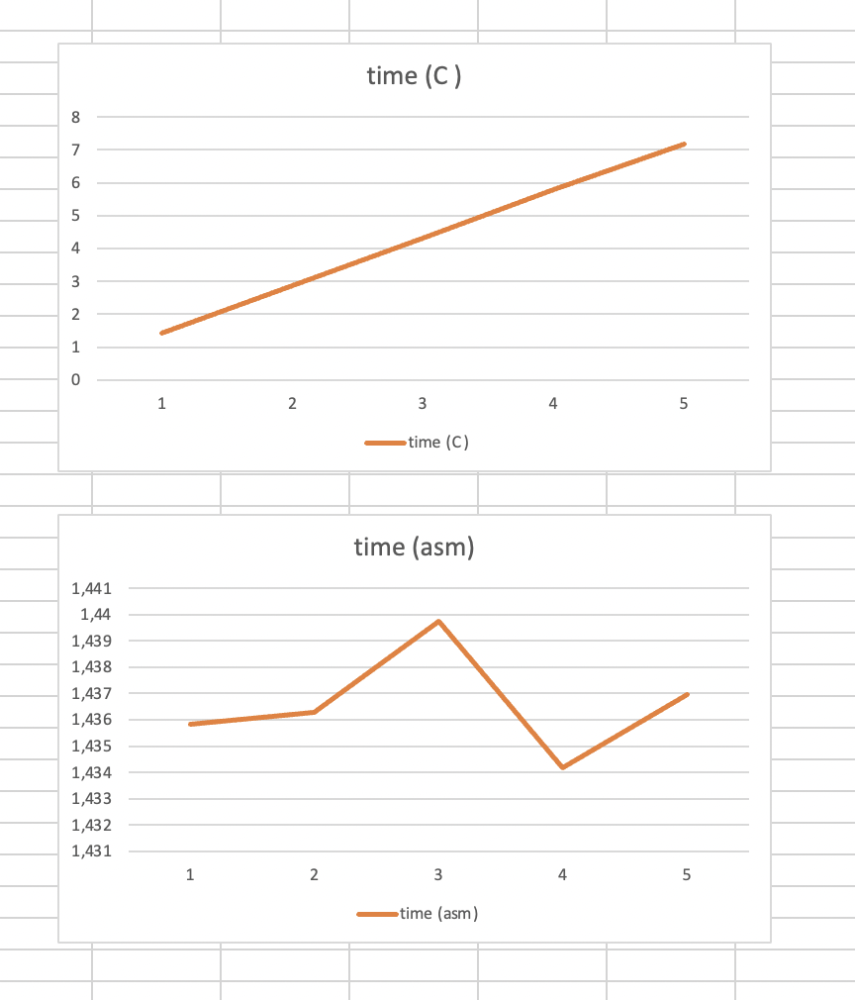
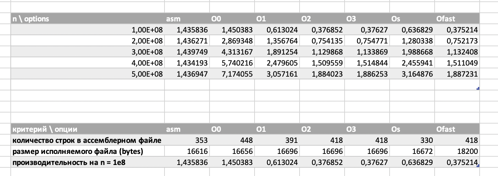

# Индивидуальное домашнее задание по АВС #2
## Сизикин Владислав Олегович (БПИ218), Вариант 8

## Задача:
    Разработать программу, вычисляющую с помощью степенного ряда с точностью не хуже 0.05% значение функции arctan(x) для заданного параметра x.

## Формат входных данных: 
Через параметры входной строки передаются параметры:
      
    {путь к исполняемому файлу} {флаг режима генерации данных} {количество циклов вычислений | опционально} {входной файл | опционально} {выходной файл}
    
    флаг режима генерации данных: "-d" (без кавычек) для ввода данных из файла, "-g" (без кавычек) для работы генератора
    количество циклов вычислений: "целое число >= 1 и <= 1000000000 - столько раз программа повторит подсчет арктангенса"
    {входной/выходной файл} - пути к файлам соответственно
    
    пример для работы в режиме ввода данных из файла:
    ./main -d in.txt out.txt
    
    пример для работы в режиме генерации случайных данных:
    ./main -g 5 out.txt
     
При работе со входным файлом: в файл вводится дробное число, арктангенс которого нужно вычислить

    1. -1 <= x <= 1

Пример:

    0.95

Вывод: 

    input data:
    0.95000000

    output data:
    0.75953853

# 4 балла
В файле [main.c](code/main.c) находится решение задачи на C (пункт 1).

Сперва была выполнена компиляция без оптимизирующих и отладочных функций, добавлены комментарии, поясняющие эквивалентное представление переменных в программе на C и в ассемблерном коде (пункт 2).

Ассемблерные файлы: [без оптимизаций](code/commented.s), [с оптимизациями](code/optimized_commented.s).

команда без оптимизаций:

    gcc -O0 -Wall -masm=intel -S -fno-asynchronous-unwind-tables main.c -o main_not_optimized.s -lm

Получили следующий [код](code/commented.s)

Далее была произведена сборка с использованием следующей команды:

    gcc -O2 -Wall -masm=intel -fno-asynchronous-unwind-tables -fcf-protection=none -S main.c -o optimized_commented.s -lm

Таким образом, мы получили ассемблерный [код](code/optimized_commented.s) без лишних макросов (пункт 3).

Произвел сборку оптимизированной программы (пункт 4), далее начал ее тестировать

Приложил тестовое покрытие, проверяющее корректную и одинаковую работу программ на C и ассемблере (пункт 5).

Тесты программы на C:

Тесты программы на ассемблере:

# 5 баллов
Программа разбита на функции read_string, process и тд - [main.c](code/main.c) (пункт 1)

[Ассемблерный код](code/optimized_commented.s)

Локальные переменные были использованы (пункт 2).

Произвел сборку, добавил комментарии, описывающие передачу фактических параметров и перенос возвращаемого результата в ассемблерный код (пункт 3).

В функции добавил комментарии для формальных параметров, описывающие связь между регистрами и стэком и параметрами языка C (пункт 4).

# 6 баллов
Произвел оптимизацию программы ассемблера за счет использования регистров процессора (скомпилировали с -O2). Программа использует регистры r12-r13 и xmm0-xmm10 (пункт 2).

Получил следующий [ассемблерный код](code/optimized_commented.s)

Добавил комментарии, поясняющие альтернативное использование регистров вместо переменных исходной программы на С (пункт 3).

Произвел тестирование, приложил результаты. Программа работает корректно, судя по итогам тестов (пункт 4).

Касательно размеров объектных и бинарных файлов:

Объектный файл после компиляции программы на Си весит 5064 байта, объектный файл после компиляции программы на ассемблере весит 5232 байта

Бинарный файл после компиляции программы на Си весит 16656 байт, бинарный файл после компиляции программы на ассемблере весит 16616 байт

То есть, несмотря на то, что объектный файл ассемблерного кода весит больше, бинарный файл получается меньше

# 7 баллов

Уже присутствует возможность задания файлов ввода/вывода с использованием аргументов командной строки (пункт 1).

Также имеется проверка на корректность числа аргументов командной строки, выводятся сообщения в случае ошибок (пункт 2)

Код на [Си](code/main.c), [ассемблер](code/optimized_commented.s)

Разбил ассемблерный файл на две единицы компиляции (пункт 3).

[Первая](code/main_part1.s), [вторая](code/main_part2.s)

Произвел успешную сборку программы:

Подготовил 4 файла с тестами (test1.txt, test2.txt, ..., test4.txt) (пункт 4)

Произвел тестирование, приложил результаты. Вывод: программа работает корректно.

# 8 баллов
Разработал генератор случайных тестовых наборов данных (пункт 1).

Он генерирует случайное дробное число x в отрезке [-1; 1]

Программа уже использует параметры коммандной строки для задания формата входных данных (из файла или генератором). Также имеется обязательная опция, задающая количество повторений программы в случае запуска ее в режиме генератора (пункт 2).

Добавил функцию замера времени исполнения, после завершения программы выводится количество времени (в консоль), которое программа обрабатывала данные (пункт 3 и 5).

Чтобы время исполнения программы было больше 1 секунды я решил повторять обработку данных q * 100000000 (где q = 1, 2, 3, 4, 5) раз. Изменения в [коде](code/main_long.c), [asm](code/optimized_commented.s)

Привожу таблицу сравнения времени работы программы на ассемблеры и программ на Си с различными опциями сборки (пункт 4)

Можно заметить, что время работы программы на С линейно, что нельзя сказать о программе на ассемблере. Скорее всего, оптимизирующие опции сократили зацикливание программы, поэтому изменение количества повторений не меняет время работы программы в этом случае.

# 9 баллов
Произвел сравнение программ ассемблера (своей, а также программ, которые получается из исходной программы на Си с различными опциями компиляции).

Прикрепляю таблицу, где указано сравнение программ по времени (пункт 1) и по размеру файлов (пункт 2)

Как мы видим, модифицируя ассемблерную программу самим, получилось добиться маленькой длины ассемблерного файла (и наименьшего размера исполняемого файла). Однако, программы с опциями -O1 и -O2 работают слегка быстрее оптимизированной программы на ассемблере (но проигрывают по размеру ассемблерного файла).

Достаточно хороший результат по размеру выходных файлов показала компиляция с опцией -Os, но по времени исполнения такой вариант слегка проигрывает -O2 и -O3.
